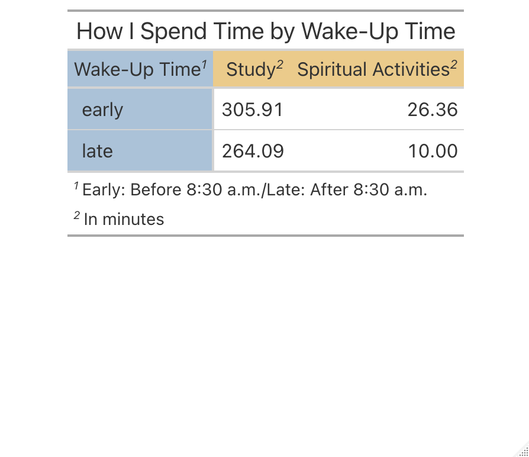

```{r setup, include = FALSE}
# load packages
library(tidyverse)
library(lubridate)
library(ical)
library(dplyr)
library(gt)

# set code chunk defaults
knitr::opts_chunk$set(tidy = F, # display code as typed
                      size = "small", # slightly smaller code font
                      message = FALSE,
                      warning = FALSE,
                      comment = "\t") 

# set black & white default plot theme 
# theme_set(theme_classic()) # uncomment this line if desired

# improve digit and NA display 
options(scipen = 1, knitr.kable.NA = '')
```

<!--
Please remove my comments from the code chunks and customize the code chunks on your own, including chunk labels and options and code documentation.

You can leave my markdown comments for guidance in writing your report.

Please rename the headings. 
You may add subheadings as desired to break up the report. 
-->

# How do I Spend My Time?

## Preliminary Data Wrangling
<!--
The code below is provided as a starting point for importing an `ics` file into R as a dataframe, doing some initial wrangling, and adding up the time spent on each activity. You are not required to use this code, so delete or modify it as you see fit. 

If you are using the code, be sure to update the capitalized parts with the relevant path to where your `ics` file is located, and set `eval = TRUE`.

As a reminder here's the link for exporting a Google calendar to ics (if on a Mac, you can hold cmd + click to open the page):
https://support.google.com/calendar/answer/37111?hl=en&ref_topic=10509946
-->
```{r}
# Data import and preliminary wrangling
calendar_data <- "/Users/angelica/Desktop/calendar_data/heylin1024@gmail.com.ics" %>% 
  # Use ical package to import into R
  ical_parse_df() %>% 
  # Convert to "tibble" data frame format
  as_tibble() %>% 
  mutate(
    # Use lubridate package to wrangle dates and times
    start_datetime = with_tz(start, tzone = "America/New_York"),
    end_datetime = with_tz(end, tzone = "America/New_York"),
    # duration_min = end_datetime - start_datetime, 
    #   //instead of this code, use the code below for the duration in minutes
    duration_min = difftime(end_datetime, start_datetime, units="mins"),
    date = floor_date(start_datetime, unit = "day"),
    # Convert calendar entry to all lowercase and rename
    activity = str_replace_all(tolower(summary), " ", "_"),
    # Convert dates to days of week
    day = wday(date, label=TRUE, abbr = FALSE)) %>% 
  filter(date >= "2021-09-09")
```

<!--
Describe your question(s) here.  Briefly describe your data collection process, including how you defined variables of interest.
-->
# Questions of Interest

In the beginning of this semester, I have been wondering how I could maximize my productivity (not just for studying, but more broadly, the activities I find meaningful) and what particular conditions enable me to spend more time on doing those meaningful activities. For the project, I intended to answer how the time I go to bed affects my studying time and how the time I wake up affect how I spend my time engaging in spiritual activities as well as studying. 

I also noticed the difference in my eating patterns from the previous semesters. As the College provided fridge and microwave per room due to the pandemic, I would end up cooking or more precisely, reheating the refrigerated foods and eating them in my room, instead of going to Val for meals. Thus, I planned to explore whether I spend more time when eating at Val or eating in my room.

# Data Collection

I collected data by tracking my daily schedule in Google Calendar for 26 days. This is what one of my days I tracked looks like:

```{r, out.width = "40%", out.height = "35%", fig.align = 'center', echo = FALSE}

```

To answer my questions above, I tracked my sleep, work time, spiritual activities (attending online service, listening to sermons and praying) and eating schedule. When I found out during the first phase of my data wrangling that the description feature of Google calendar could be used for my data analysis, I tried to make my entries(i.e. summary or title of an activity) general and simple for the sake of consistency and convenience of analysis and recorded different attributes in the description so I could conduct more meaningful analysis. For example, when describing what work I did, I wrote the class name in the description slot. For meals, I recorded the place I ate (Val or room) and whom I ate with (alone or friends), separated by semicolons.

```{r, out.width = "40%", out.height = "35%", fig.show = 'hold', fig.align = 'center', echo = FALSE}
knitr::include_graphics("google_calendar3.png")
knitr::include_graphics("google_calendar2.png")
```


# RESULTS
## Question 1 How does sleep affect my productivity?

First, I looked at the relationship between the time I wake up and the average amount of time I spend everyday studying and doing spiritual activities. I created a contingency table where each row corresponds to whether I wake up early (before 8:30 a.m.) or late (after 8:30 a.m.) and each column represents the type of activities. The table shows that there seems to be a clear association. On a day I wake up early, I spend on average 305.91 minutes studying, which is approximately 42 minutes more than when I wake up late. For spiritual activities, I spend around 26 minutes when I wake up early, which is more than twice as much compared to when I get up late. However, I cannot conclude from this visualization that I spend more time on those activities because rising early actually boosts my productivity, or simply because I have more time during the day to get work done.

### Data Wrangling
```{r}
calendar_data2 <- calendar_data %>% 
  select(activity, end, duration_min, date) %>% 
  mutate(activity2 = case_when(
    #Combine different religious activities into "spiritual" category
    activity == "pray" ~ "spiritual",
    activity == "church" ~ "spiritual",
    activity == "online_service" ~ "spiritual",
    # Rename the data entries that fail to follow the pattern
    str_detect(activity, "posc|data") ~ "study",
    TRUE ~ activity)) %>% 
  # Work only with sleep, study, spiritual activities for the table
  filter(activity2 %in% c("spiritual", "sleep", "study")) %>% 
  #compute total duration for each day and each activity
  group_by(date, activity2) %>% 
  summarize(duration_min = sum(duration_min))

# Data set for tracking whether I woke up early(before 8:30)/late(after 8:30)
wakeUp <- calendar_data %>% 
  filter(activity == "sleep") %>% 
  mutate(wakeUp = ifelse(format(end, format = "%H:%M:%S") < "08:31:00", 
                         "early", "late")) %>% 
  select(date, wakeUp)

# Make a wide data set, each row representing each day; left join it with sleep data
calendar_data3 <- calendar_data2 %>% 
  pivot_wider(names_from = activity2, values_from = duration_min, 
              values_fill = as.difftime(0, units = "mins")) %>% 
  left_join(wakeUp, by="date")

#Contingency table that shows the relationship between the time I woke up and 
                      #average time spent on studying and spiritual activities
calendar_data4 <- calendar_data3 %>% 
  group_by(wakeUp) %>% 
  summarize(study = as.numeric(mean(study)), spiritual = as.numeric(mean(spiritual))) %>% 
  filter(!is.na(wakeUp))
```

### Visualization
```{r, out.width="60%", out.height="60%", fig.align='center'}
g <- calendar_data4 %>% 
  # Make the wake-up variable into a stub instead of a column
  gt(rowname_col = "wakeUp") %>% 
  tab_stubhead(label = "Wake-Up Time") %>% 
  tab_header(title = "How I Spend Time by Wake-Up Time") %>% 
  tab_footnote(footnote = "In minutes",
               locations = cells_column_labels(columns = c(study, spiritual))) %>% 
  tab_footnote(footnote = "Early: Before 8:30 a.m./Late: After 8:30 a.m.",
               locations = cells_stubhead()) %>% 
  # Rename the column names
  cols_label(study = "Study", spiritual = "Spiritual Activities") %>% 
  # Format the values to have 2 decimal places
  fmt_number(columns = c(study, spiritual), decimals = 2) %>% 
  tab_style(style = cell_fill(color = "#ebcb8b"), 
            locations = cells_column_labels(columns = c(study, spiritual))) %>% 
  tab_style(style = cell_fill(color = "#abc2d8"), locations = cells_stub()) %>% 
  tab_style(style = cell_fill(color = "#abc2d8"), locations = cells_stubhead()) 

# Couldn't display the table created with gt package in Rmd; include it as an image instead

```

Looking at this table, I became interested if my bedtime would also be associated with my work time. I created a boxplot to show how the amount of time I spend studying varies with my bedtime. I considered going to bed before 1 a.m. early and after 1 a.m. late. The boxplot shows that variability of the amount of time is similar in terms of distribution, but the median time spent on studying is higher when I go to bed early than when I sleep late. While I would have more time to work when I sleep late, the actual (median) time I spent studying is less than when I wake up early. This suggests that bed time might be associated with my productivity.

### Data Wrangling
```{r}
# Data set for tracking whether I went to bed early/late
sleep <- calendar_data %>% 
  filter(activity == "sleep") %>% 
  mutate(bedtime = ifelse(format(start, format = "%H:%M:%S") < "01:01:00", 
                        "early", "late")) %>% 
  select(date, bedtime) 

# Joined the sleep data set with another data set that contains total daily studying time 
sleep_study <- calendar_data2 %>% 
  filter(activity2 == "study") %>% 
  right_join(sleep, by = "date") %>% 
  select(-activity2) %>% 
  dplyr::rename(study_duration = duration_min)
```

### Visualization
```{r, fig.height=3.5, fig.width=4.5, fig.align='center'}
MyCol2 <- c("#bfa19c", "#7b92a8")
ggplot(data = sleep_study, aes(x=bedtime, y=study_duration, fill = bedtime)) + 
  geom_boxplot() +
  labs(x = "Bed Time",
       y = "Time Spent on Studying (minutes)",
       title = "Time Spent on Studying by Bed Time",
       caption = "Early: Before 1 a.m. / Late: After 1 a.m."
       ) + 
  theme(legend.position = "none",
        plot.title = element_text(hjust = 0.5)) +
  scale_fill_manual(values = MyCol2)
```


## Question 2 How do I spend time eating?

I created a stacked barplot that depicts whether eating alone or with others affects the amount of time I eat, and facetted it by the place I eat, to see if it has any effect on my eating time. It seems I spend so much more time--more than 200 minutes--eating with friends in my room, but, in fact, that is an outlier. I have only eaten twice with friends in my room when we cooked and watched movies together, both of which took us more than 2 hours. I also see that when I eat alone, I spend similar amount of time eating regardless of the dining area. However, more time is spent when I eat with friends both in Val and my room. This means that it is whom I eat with, not where I eat, that works as a factor that affects my eating time. 

### Data Wrangling
```{r}
# Calculate the average time spent on washing dishes
calendar_data %>%
  filter(str_detect(activity, "dish")) %>%
  mutate(activity2 =  case_when(str_detect(activity, "dish") ~ "dishes")) %>%
  select(date, activity2, duration_min) %>%
  pivot_wider(names_from = activity2, values_from = duration_min,
              values_fill = as.difftime(0, units = "mins")) %>%
  summarize(avg = mean(dishes)) %>% 
  pull(avg)

meals <- calendar_data %>% 
  #Include only the rows with descriptions that contain semicolons 
  #                                       (i.e. rows that are related to meals)
  filter(str_detect(description, ";")) %>% 
  # Split the description by semicolon into two different columns 
    # description before the semicolon represents place where I ate
    # description after the semicolon represents whom I ate with
  separate(description, c("place","person"), sep = ";") %>% 
  select(date, place, person, eating = duration_min) %>% 
  mutate(
    eating = as.numeric(eating),
    #Add a column for time spent on washing dishes based on the calculation above
    dishes = case_when(place == "Room" ~ 25,
                       TRUE ~ 0),
    #Add a column for time spent on walking over to Val based on manual tracking
    walking = case_when(place == "Val" ~ 20,
                        TRUE ~ 0)
  ) %>% 
  # Make it into a long data set 
  #       so each activity associated with eating meals is in one column
  pivot_longer(c("eating", "dishes", "walking"), 
               names_to = "type", values_to = "duration") %>% 
  mutate(type = factor(type, levels = c("eating", "dishes", "walking"))) %>% 
  group_by(place, person, type) %>% 
  # Calculate mean duration by the place where I ate, whom I ate with, and type of activity
  summarize(duration = mean(duration))
```

### Visualization
```{r, fig.width=5.5, fig.height=3.5, fig.align='center'}
#stacked barplot
MyCol3 <- c("#DBDB8D", "#AEC7E8", "#C49C94")
ggplot(meals, aes(y=duration, x=person, fill = type)) + 
    geom_bar(position="stack", stat="identity") + 
    facet_wrap(~place) +
  # Rename legend labels
  scale_fill_manual(labels = c("Eating", "Washing Dishes", "Walking over to Val"), 
                    values = MyCol3) +
    labs(y = "Duration (minutes)",
       x = "Whether I eat alone or with friends",
       title = "Meal Time by Dining Area and Whom I Ate with") +
  # Remove legend title
  theme(legend.title = element_blank(),
        plot.title = element_text(hjust = 0.5))
```

I also wanted to explore the relationship between eating regular meals and my productivity, though not addressed in the initial questions of interest. Often when I skipped meals to get work done, I rather found myself snacking and binging in my room, only to feel bad and lose productivity. That being said, I expected that there would be a negative association between time gap between meals and productivity. However, the scatterplot shows that it is exactly the opposite. With the correlation coefficient of 0.34, they have a positive, albeit weak, relationship. Does this really mean I become more productive if I skip meals? While I tracked the duration of studying to measure productivity, it might not accurately represent that information because the time I was distracted was not excluded accurately. When I skipped meals (and fell into the vicious cycle of binge-eating), I might have had more time to study and actually ended up spending more time studying (possibly by reducing sleep) to compensate for the wasted time, but that would not necessarily mean I was feeling more productive.

### Data Wrangling
```{r}
meals2 <- calendar_data %>% 
  filter(activity %in% c("breakfast", "lunch", "dinner")) %>%
  select(date, activity, end_datetime) %>% 
  # Add omitted data entries manually
  add_row(date = c(as.POSIXct("2021-09-29" , format="%Y-%m-%d"), 
                   as.POSIXct("2021-09-30" , format="%Y-%m-%d"), 
                   as.POSIXct("2021-10-05" , format="%Y-%m-%d")),
          end_datetime = c(as.POSIXct("2021-09-29 20:30:00", format="%Y-%m-%d %H:%M:%S"), 
                   as.POSIXct("2021-09-30 20:30:00", format="%Y-%m-%d %H:%M:%S"), 
                   as.POSIXct("2021-10-05 20:30:00", format="%Y-%m-%d %H:%M:%S"))) %>% 
  arrange(end_datetime) %>% 
  # For the time gaps greater than 26, set them to be NA 
  #                             because that means I forgot to track the meals
  mutate(gap = ifelse(end_datetime - lag(end_datetime) > 26, NA, 
                      end_datetime - lag(end_datetime))) %>% 
  # Remove rows for breakfast because the long time gaps between the previous day's meal 
  # and the current day's breakfast are quite obvious and thus lack meaning 
  filter(activity != "breakfast") %>% 
  group_by(date) %>% 
  summarize(mean_gap = mean(gap))

# Data set for total daily studying time
study <- calendar_data %>% 
  filter(activity == "study") %>% 
  group_by(date) %>% 
  summarise(duration = sum(duration_min))

meals_study <- meals2 %>% 
  left_join(study)
```

### Visualization
```{r, fig.width=5, fig.height=3.5, fig.align='center'}
#scatterplot: Relationship between Time Gap between Meals and Productivity
ggplot(data = meals_study, aes(x = mean_gap, y = duration)) +
  geom_point() +
  geom_smooth(method='lm', se = FALSE) + 
  labs(y = "Time spent on studying (minutes)",
       x = "Average time gap between meals (hours)",
       title = "Productivity vs Time Gap between Meals ") + 
  theme(plot.title = element_text(hjust = 0.5))

# Correlation Coefficient between average time gap between meals and study time
with(meals_study, cor(as.numeric(mean_gap), as.numeric(duration), use="complete.obs"))
```
\newpage

## Question 3 Is the type of course related to the time I spend studying for it?

This question is also not one of my initial questions, but as the semester progressed, I found myself spending disproportionately more time studying for my POSC course than the other two STEM courses(CS and Data Science). This led me to wonder if the the course type is actually associated with how I spend time studying. In order to investigate that relationship, I first created a line graph showing the amount of time I study each day for each course I am taking this semester. It shows that except for Thursday, I constantly invest my time in studying for POSC class throughout the week. That would be because being a slow reader, I split up the workload to finish 100-page readings assigned for every class. Thursdays are an exception because once I am done with the class on Wednesday, I choose to allocate my Thursdays to study for other courses. Though the graph shows that I also work on Data Science quite constantly throughout the week, I tend to spend more time working on the POSC each day. And for Data Science, I work the most on Fridays presumably because we have problem sets due every Friday. I seem to do the most work on Thursdays for CS because we have homeworks due Friday mornings. However, I see that I do not devote as much time to CS for the rest of the week.


### Data Wrangling
```{r}
# Correct data entry error
calendar_data[65,]$description <- "POSC 145" 

calendar_data5 <- calendar_data %>% 
  # Convert course names to all lowercase and replace spaces with underscores
  mutate(course = str_replace_all(tolower(description), " ", "_")) %>% 
  # Filter the data set to focus on studying time
  filter(course %in% c("posc_145", "cs", "data_science")) 

calendar_data6 <- calendar_data5 %>% 
  select(day, date, course, duration_min) %>% 
  # Add rows so that duration counts as 0 
  #                     for the days when I didn't work on a particular course
  add_row(day = c("Thursday", rep("Thursday",4), 
                rep("Friday", 4), rep("Friday", 2),
                rep("Saturday", 3), "Saturday", rep("Saturday", 4),
                rep("Sunday", 3), "Sunday", rep("Sunday", 3),
                rep("Monday", 2), "Monday", "Monday",
                rep("Tuesday", 3), rep("Tuesday", 2), "Tuesday",
                rep("Wednesday", 3), "Wednesday", rep("Wednesday", 2)),
          course = c("cs", rep("posc_145", 4),
                           rep("cs", 4), rep("data_science", 2),
                           rep("cs", 3), "posc_145", rep("data_science", 4),
                           rep("cs", 3), "posc_145", rep("data_science", 3),
                           rep("cs", 2), "posc_145", "data_science",
                           rep("cs", 3), rep("posc_145", 2), "data_science",
                           rep("cs", 3), "posc_145", rep("data_science", 2)),
          duration_min = as.difftime(0, units = "mins")) %>% 
  # Reorder days of week for visualization
  mutate(day = factor(day, levels = c("Monday", "Tuesday", "Wednesday",
                                      "Thursday", "Friday", "Saturday", 
                                      "Sunday"))) %>% 
  group_by(day, course) %>%
  # Calculate mean time spent on studying for each course by days of week
  summarize(mean = mean(duration_min))
```

### Visualization
```{r, fig.width=6, fig.height=3.5, fig.align='center'}
MyCol <- c("#7b92a8", "#82853B", "#C85200")

#line graph
ggplot(data = calendar_data6, aes(x=day, y = mean, group = course, 
                                  color = course)) +
  geom_line(aes(color = course)) + 
    geom_point() +
  # change legend labels to the actual course names
  scale_color_manual(labels = c("CS112", "STAT 231", "POSC 145"),
                     values = MyCol) + 
  labs(x = "Days of Week",
       y = "Time Spent (minutes)",
       color = "Course Name",
       title = "Time Spent on Studying by Course") +
  theme(plot.title = element_text(hjust = 0.5))
```


As mentioned above, I divide up the workload for my POSC class because I often find non-STEM courses more challenging than STEM courses. And I wanted to confirm if my data captures my anxiety about non-STEM courses. I looked at the distribution of the time I spent studying *in one sitting* by course types--STEM and non-STEM. Although there is more variation in study time for STEM courses, the median time is higher. On the contrary, the entire distribution of time spent studying for non-STEM courses lies at and even below the bottom end of the distribution for STEM classes. This validates that I tend to have poor concentration when I work on my POSC course.

### Data Wrangling
```{r}
calendar_data7 <- calendar_data5 %>% 
  # classify couses into STEM and non-STEM
  mutate(type = case_when(course == "posc_145" ~ "non-STEM",
                          str_detect(course, "cs|data") ~ "STEM")) 
```

### Visualization
```{r, fig.width=5, fig.height=3.5, fig.align='center'}
#boxplot
MyCol2 <- c("#bfa19c", "#7b92a8")
ggplot(data = calendar_data7, aes(x=type, y = duration_min, fill = type)) +
  geom_boxplot() +
  labs(x = "Course Type",
       y = "Time Spent (minutes)",
       title = "Time Spent on Studying by Course Type") + 
  theme(legend.position = "none") +
  scale_fill_manual(values = MyCol2) +
  theme(plot.title = element_text(hjust = 0.5))
```


<!--
To conclude, briefly summarize what you found in response to the questions posed here.
-->

In general, sleep does affect my productivity in that waking up early and going to bed early seems to enables me to dedicate more time to the activities I find meaningful, in addition to my academics. While I expected that I would spend more time eating when I eat in my room than in Val because I need to cook and wash dishes, dining area does not seem to really matter according to the stacked barplot; instead, the average duration of having meals is much higher when I eat with others. Additionally, visualizations convey that my study time varies with which course I am working on. The line graph validates my feelings that the amount of time I spend on POSC course is disproportionate(because I split up the workload for the course throughout the week), and the boxplot confirms I tend to show poor concentration when I study for POSC, unable to work longer than 100 minutes in one sitting.

\newpage
# REFLECTION

<!--
Write your one-page reflection here in paragraph form.  In particular, address:

* What difficulties in the data collection and analysis process did you encounter?  Identify two of your main hurdles in gathering accurate data.

* What implications does that have for future data collection and/or analysis projects? 

* How much data do you think you'd need to collect in order to answer your question(s) of interest? Would it be hard to collect that data? Why or why not?

* As someone who provides data, what expectations do you have when you give your data (e.g. to Facebook, Google, MapMyRun, etc.)?  

* As someone who analyzes others' data, what ethical responsibilities do you have?
-->
Collecting my daily schedule data was insightful but definitely challenging at times. I had planned to track time spent eating and talking with friends separately when I eat with friends, but the distinction was not clear and I ended up recording the *total* amount of time I spent eating each meal. I also had tried to keep track of dish-washing time for each meal when I eat in my room, but I was not always able to do the dishes immediately after eating each meal if I had meetings or classes afterwards and did them all at once a few times a week. To address this issue, I calculated the overall average time spent washing dishes and added it manually to the data set. 

Another challenge when analyzing my study time was taking into account the consistency. When I tried to calculate the average time I worked on each course for each day of week, I observed that the mean time spent studying for CS was much higher than for the POSC course, even though I was certainly dedicating more time to the POSC course. This was because the mean was not weighted--for CS, the sum and mean time on a particular day was equal because I have studied for CS on that day only once throughout the entire data collection period, while I worked on POSC on that day every week. To solve this issue, I had to manually add the rows with duration of 0 for the days I did not work on a particular course and weight the average based on those rows.

The scatterplot depicting the relationship between time gaps between meals and productivity failed to prove my hypothesis that eating regular meals would positively affect my productivity. This may be due to the fact that I lacked data to control for a potential confounding variable: the actual level of productivity. I tracked the time I actually concentrated as best as I can as a measure of productivity, it might not be accurate because I was not able to measure every single time I got distracted in between. For future data collection, I would consider the quality of work being produced or the proportion of time wasted out of the total intended work time as my productivity variable. Yet, it would be quite challenging to collect the quality of work being done because it is such subjective, not to mention qualitative, data. Additionally, if I could redo this project, I would collect data over a longer period of time and run significance tests so that I can make conclusions about statistically significant results.

As someone who provides data, I expect that my data is treated with ethical considerations. I expect that my data is kept confidential and anonymous so that it cannot be traced to its provider. In order to ensure privacy of my data, I hope that data usage and any information gathered in the data analysis procedure are clearly communicated to me.

As a data analyst, I think it is imperative to be aware of ethical implications of my analysis, given the privacy and sensitivity of the data. It is important to communicate the use of data and obtain informed consent from the data provider. I would also have to be very cautious about my personal opinions or bias that might get in the way of accurate data analysis procedure.

